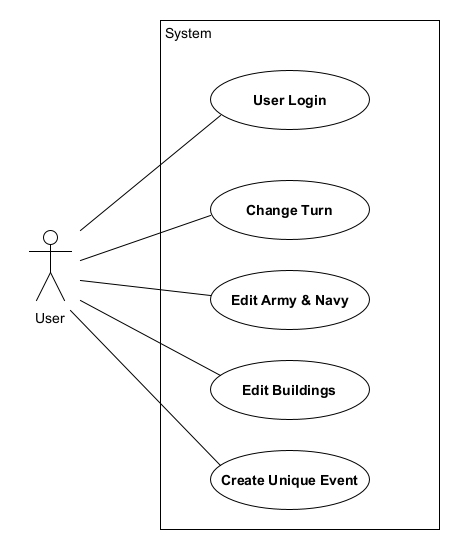

# Massilia Roleplay

### Brief description

A wep application for automating the Massalia roleplay Discord server's game.

### Main documents

* [Software requirements](docs/markdown/software-requirements.md)
* [Design model](docs/markdown/design-model.md)

### Application description

##### Economy

The game is turn-based and each turn represents a span of 6 months. After each turn a new balance is calculated based on the players' actions. The virtual city's income is the sum of its taxation, trade, tributes and other one time events. On the other hand, the city's expenses result from the army's and navy's upkeep costs, plus the infrastructure's maintenance expenses. One time events may also affect the city's expenses. A balance sheet is generated at the end of each turn, while the previous turn's balance sheet is archived.

##### Army & navy

The web app stores the amount of each unit present in the Massilian army and navy. Each unit has a specific upkeep cost. Using the previous data, the application can calculate the entire upkeep cost the city must pay each turn. New units and unit types can also be created using the website.

##### Infrastructure

The city of Massilia has a number of buildings that contribute to the city's prosperity. Every building must be maintained every 2 turns. Thus, every buidling's expenses must be taken into consideration at the end of every other turn. The city can house multiple buildings of the same type. New building types can also be created.

##### Demographics

Demographics constitute a separate category of the game. Each city and settlement has a number of residents. Once per two turns, a city's population is increased by 3%.

##### Users

As of now all users have the same privileges and are subject to the same restrictions. That means that only a handful of trusted people can have access to the website. Users require only a username and a password.

### Functional requirements

1. Users can login using their username and password.
2. Turns have only one balance sheet.
3. A balance sheet is composed by an income section and an expenses section.
4. The income section is generated using the city's taxation, trade income, polis tributes and unique events that add income.
5. The expenses section contains the upkeep costs and the infrastructure maintenance expenses, in addtion to any unique events that create more expenses.
6. The units' upkeep and the infrastructure's maintenance costs are calculated using the city's army, navy and buildings stats.
7. Unique events influence only 1 turn.
8. Users can create new units.
9. Users can create new unit types.
10. Users can create new buildings.
11. Users can create new building types.
12. One or more instances of a building type may exist.
13. A city's population holds the number of residents each city has.

### Use case diagram

