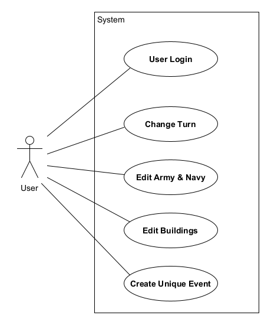

[< Back](../../README.md)

# Software requirements

### Introduction

This document presents a synopsis of the software requirements for the online application. The document also elaborates on second use case, named *"Change Turn"*.

### Full description

##### Use case diagram

##### Assumptions and dependencies

* We assume that only one city, Massilia, is represented in detail. In other words,
    * Only Massilia has a treasury,
    * an army,
    * a navy,
    * and buildings.
* All cities(polis), apart from Massilia, are represented using extremely simple classes.
* Other cities may be mentioned in unique events, but they only add modifiers to the economy(balance sheet), the army, the navy or to a city's population.
* For the time being, the application cannot rollback to a previous turn!

#### Use cases

##### Actors

| Actor | Description |
| :---: | ----------- |
| User  | Every person in possession of an account. |

##### Use cases' descriptions

##### UC1 - User Login

##### [UC2 - Change Turn](uc2-change-turn.md)

##### UC3 - Edit Army & Navy

##### UC4 - Edit Buildings

##### UC5 - Create Unique Event

#### Auxilliary specifications

##### User interfaces

| Use case | Description |
| :------: | ----------- |
| 1        | The user logins using a simple HTML form. |
| 2        | An *"End Turn"* button is always present on the right side of the navbar. |
| 3, 4  | Army units, navy vessels and buildings use similar, simplistic forms. |

##### Quality characteristics

##### Efficiency

* A CSS framework called [Tailwind CSS](https://tailwindcss.com/) is used for increasing the speed at which the front-end is being developed.

##### Availability

* The site's availability depends on the server's host.

##### Safey

* The Django framework handles almost all of our safety features.
* It is up to the creator to limit the number of people possessing accounts and thus protect the website.

##### Flexibility

* The website's UI is scalable for desktop and mobile users alike.

##### Ease of use

* An identical navbar always sticks at the top of the page for ease of use.
* The navbar contains links to all important parts of the application.
