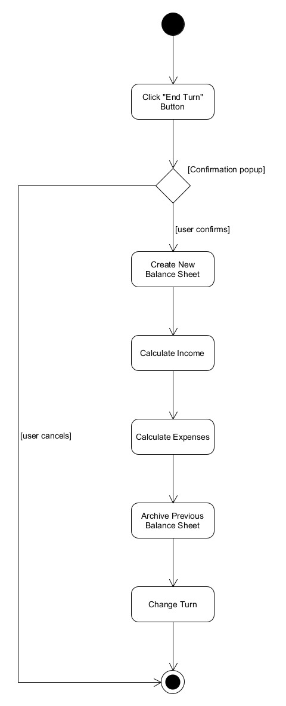

[< Back](software-requirements.md)

### UC2 - Change Year

**Primary actor**: User  
**Affiliated actors**: The user initiates the use case by clicking on the *"End year"* button.  
**Assumptions**: The user wishes to end the current year. The user has probably altered some of the city's stats or has created unique events.

#### Basic flow

##### A) The user ends the current year

1. The *user* clicks on the *"End year"* button.
2. The *user* confirms his previous action at the popup that appears.

##### Alternative flow

2b. The *user* cancels his previous action.

1. The use case ends.

##### B) The new balance sheet is generated

1. Create new balance sheet.
2. Calculate income from all sources(including unique events).
3. Calculate the cost for all expenses.
5. Archive the previous balance sheet.
6. Change the year.

#### Activity diagram

